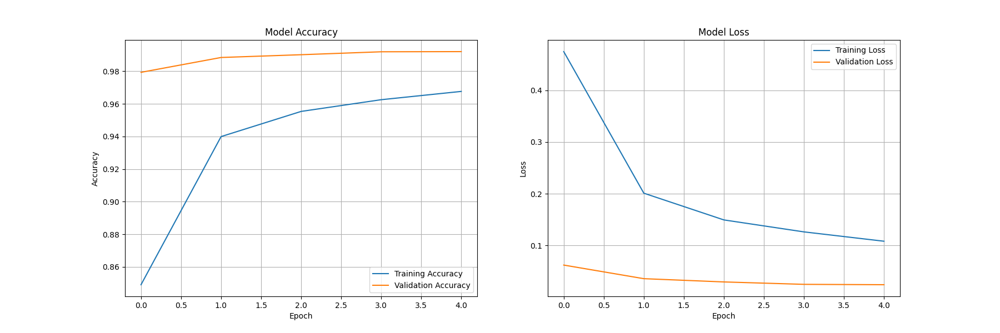

# Vision AI in 5 Days: From Beginner to Image Recognition Expert

This project, created for the "Build an AI That Sees" bootcamp, involves building and evaluating two different types of Convolutional Neural Networks (CNNs) to classify handwritten digits from the MNIST dataset.

## Project Outline

1.  **Custom CNN Model**: A basic CNN was built from scratch using TensorFlow/Keras. It was trained on the MNIST dataset with data augmentation to improve performance.

2.  **Transfer Learning Model**: A pre-trained model, **MobileNetV2**, was fine-tuned on the MNIST dataset to leverage the power of transfer learning.

3.  **Comparison**: The performance of both models was compared to analyze the effectiveness of transfer learning.

---

## Model 1: Custom CNN

A simple CNN with two convolutional layers was built and trained.

* **Techniques Used**: Data Augmentation (Rotation, Zoom).

* **Final Accuracy**: **99.26%**

### Custom CNN - Visualizations

*This model's visualizations show its learning progress and performance.*

**Training Curves**

**Confusion Matrix**

---

## Model 2: Transfer Learning with MobileNetV2

The powerful, pre-trained MobileNetV2 model was adapted for our digit recognition task.

* **Technique Used**: Fine-tuning a pre-trained model.

* **Final Accuracy**: **96.99%**

This demonstrates that while the custom model performed exceptionally well on this simple dataset, transfer learning is a powerful technique for more complex problems.

---

## How to Run the Code

1.  Open the `image_recognition_notebook.ipynb` notebook file in Google Colab.

2.  Ensure the runtime is set to **T4 GPU**.

3.  Run all the cells sequentially from top to bottom.
